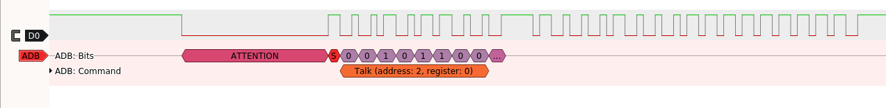

# Apple Desktop Bus (ADB) protocol decoder for Sigrok

This is a crude & half-working ADB protocol decoder. Some ADB signals recorded with a FX2LP dev boards are available in this repository so that you can test this decoder, and maybe improve on it ? :-)

